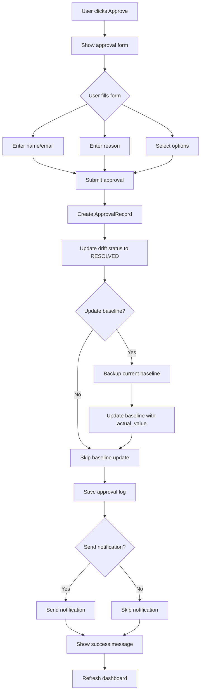

# 📋 Approve Drift - Implementation Plan

## 🎯 Mục tiêu

Xây dựng chức năng **Approve Drift** đầy đủ để cho phép người dùng chấp nhận và lưu lại các thay đổi infrastructure như là cấu hình chuẩn mới.

## ❌ Vấn đề hiện tại

File: `app/dashboard/app.py` (dòng 763-768)

```python
if st.button("✅ Approve Drift", key=f"approve_{drift_id}", use_container_width=True):
    st.success("✅ Drift approved - keeping current configuration")
    st.info("📝 Drift marked as intentional change")
```

**Thiếu sót:**
- Không cập nhật trạng thái drift
- Không lưu baseline state mới
- Không có audit trail
- Không có thông tin người approve
- Không gửi notification

---

## 🏗️ Kiến trúc giải pháp

### 1. Data Models

#### 1.1. Thêm model ApprovalRecord

**File mới:** `app/models/approval.py`

```python
from dataclasses import dataclass
from datetime import datetime
from typing import Optional
from pydantic import BaseModel, Field


class ApprovalRecord(BaseModel):
    """Record of drift approval."""
    
    approval_id: str = Field(..., description="Unique approval identifier")
    drift_id: str = Field(..., description="Associated drift ID")
    resource_id: str = Field(..., description="Resource ID")
    resource_type: str = Field(..., description="Resource type")
    
    # Approval metadata
    approved_by: str = Field(..., description="User who approved")
    approved_at: datetime = Field(default_factory=datetime.utcnow)
    approval_reason: Optional[str] = Field(None, description="Reason for approval")
    
    # State snapshots
    previous_baseline: dict = Field(..., description="Previous baseline state")
    new_baseline: dict = Field(..., description="New approved state")
    
    # Tracking
    environment: Optional[str] = Field(None, description="Environment")
    tags: dict[str, str] = Field(default_factory=dict)


class ApprovalRequest(BaseModel):
    """Request to approve a drift."""
    
    drift_id: str
    approved_by: str
    reason: Optional[str] = None
    update_baseline: bool = Field(default=True, description="Update baseline state")
    notify: bool = Field(default=True, description="Send notifications")
```

#### 1.2. Cập nhật DriftRecord

**File:** `app/models/drift.py`

Thêm trường:
```python
class DriftRecord(BaseModel):
    # ... existing fields ...
    
    # Approval tracking
    approved: bool = Field(default=False, description="Whether drift is approved")
    approved_by: Optional[str] = Field(None, description="User who approved")
    approved_at: Optional[datetime] = Field(None, description="Approval timestamp")
    approval_reason: Optional[str] = Field(None, description="Approval reason")
```

---

### 2. Service Layer

#### 2.1. ApprovalService

**File mới:** `app/services/approval_service.py`

```python
import json
from datetime import datetime
from pathlib import Path
from typing import Optional
import uuid

from app.models.approval import ApprovalRecord, ApprovalRequest
from app.models.drift import DriftRecord, DriftStatus
from app.utils.logger import get_logger

logger = get_logger(__name__)


class ApprovalService:
    """Service for handling drift approvals."""
    
    def __init__(self):
        self.baseline_file = Path("data/baseline/baseline_state.json")
        self.approval_log_dir = Path("data/approvals")
        self.approval_log_dir.mkdir(parents=True, exist_ok=True)
    
    async def approve_drift(
        self, 
        drift: DriftRecord, 
        request: ApprovalRequest
    ) -> ApprovalRecord:
        """
        Approve a drift and update baseline.
        
        Steps:
        1. Create approval record
        2. Update drift status
        3. Update baseline state (if requested)
        4. Save audit log
        5. Send notifications (if requested)
        
        Args:
            drift: Drift record to approve
            request: Approval request details
            
        Returns:
            ApprovalRecord with approval details
        """
        logger.info(f"Processing approval for drift {drift.drift_id}")
        
        # Load current baseline
        previous_baseline = self._load_baseline()
        
        # Create approval record
        approval = ApprovalRecord(
            approval_id=f"approval-{uuid.uuid4().hex[:8]}",
            drift_id=drift.drift_id,
            resource_id=drift.resource_id,
            resource_type=drift.resource_type,
            approved_by=request.approved_by,
            approved_at=datetime.utcnow(),
            approval_reason=request.reason,
            previous_baseline=self._get_resource_baseline(
                previous_baseline, drift.resource_id, drift.resource_type
            ),
            new_baseline=drift.actual_value,
            environment=drift.environment,
            tags=drift.tags,
        )
        
        # Update drift record
        drift.status = DriftStatus.RESOLVED
        drift.approved = True
        drift.approved_by = request.approved_by
        drift.approved_at = approval.approved_at
        drift.approval_reason = request.reason
        
        # Update baseline if requested
        if request.update_baseline:
            self._update_baseline(drift, previous_baseline)
            logger.info(f"Baseline updated for {drift.resource_id}")
        
        # Save approval log
        self._save_approval_log(approval)
        logger.info(f"Approval logged: {approval.approval_id}")
        
        # Send notifications if requested
        if request.notify:
            await self._send_approval_notification(drift, approval)
        
        return approval
    
    def _load_baseline(self) -> dict:
        """Load current baseline state."""
        if not self.baseline_file.exists():
            return {}
        
        with open(self.baseline_file) as f:
            return json.load(f)
    
    def _get_resource_baseline(
        self, 
        baseline: dict, 
        resource_id: str, 
        resource_type: str
    ) -> dict:
        """Extract specific resource from baseline."""
        # Map resource type to baseline key
        type_mapping = {
            "aws_instance": "ec2_instances",
            "aws_s3_bucket": "s3_buckets",
            "aws_rds_instance": "rds_instances",
            "aws_dynamodb_table": "dynamodb_tables",
        }
        
        key = type_mapping.get(resource_type, resource_type)
        resources = baseline.get(key, [])
        
        for resource in resources:
            if resource.get("id") == resource_id:
                return resource
        
        return {}
    
    def _update_baseline(self, drift: DriftRecord, current_baseline: dict):
        """Update baseline with approved state."""
        # Map resource type to baseline key
        type_mapping = {
            "aws_instance": "ec2_instances",
            "aws_s3_bucket": "s3_buckets",
            "aws_rds_instance": "rds_instances",
            "aws_dynamodb_table": "dynamodb_tables",
        }
        
        key = type_mapping.get(drift.resource_type, drift.resource_type)
        
        if key not in current_baseline:
            current_baseline[key] = []
        
        resources = current_baseline[key]
        
        # Find and update resource
        updated = False
        for i, resource in enumerate(resources):
            if resource.get("id") == drift.resource_id:
                # Merge actual_value into baseline
                resources[i] = {**resource, **drift.actual_value}
                updated = True
                break
        
        # Add if not exists
        if not updated:
            resources.append({
                "id": drift.resource_id,
                **drift.actual_value
            })
        
        # Save updated baseline
        self._save_baseline(current_baseline)
    
    def _save_baseline(self, baseline: dict):
        """Save baseline to file."""
        # Backup current baseline
        if self.baseline_file.exists():
            backup_file = self.baseline_file.with_suffix('.backup.json')
            backup_file.write_text(self.baseline_file.read_text())
        
        # Save new baseline
        with open(self.baseline_file, 'w') as f:
            json.dump(baseline, f, indent=2)
    
    def _save_approval_log(self, approval: ApprovalRecord):
        """Save approval to audit log."""
        log_file = self.approval_log_dir / f"{approval.approval_id}.json"
        with open(log_file, 'w') as f:
            json.dump(approval.dict(), f, indent=2, default=str)
    
    async def _send_approval_notification(
        self, 
        drift: DriftRecord, 
        approval: ApprovalRecord
    ):
        """Send notification about approval."""
        # TODO: Integrate with notification system
        logger.info(
            f"Approval notification: {drift.resource_id} approved by "
            f"{approval.approved_by}"
        )
    
    def get_approval_history(
        self, 
        resource_id: Optional[str] = None
    ) -> list[ApprovalRecord]:
        """Get approval history."""
        approvals = []
        
        for log_file in self.approval_log_dir.glob("*.json"):
            with open(log_file) as f:
                data = json.load(f)
                approval = ApprovalRecord(**data)
                
                if resource_id is None or approval.resource_id == resource_id:
                    approvals.append(approval)
        
        return sorted(approvals, key=lambda x: x.approved_at, reverse=True)
```

---

### 3. Dashboard Integration

#### 3.1. Cập nhật Dashboard UI

**File:** `app/dashboard/app.py`

```python
# Import service
from app.services.approval_service import ApprovalService
from app.models.approval import ApprovalRequest

# Initialize service
approval_service = ApprovalService()

# Replace existing approve button logic
with col1:
    if st.button(
        "✅ Approve Drift", 
        key=f"approve_{drift_id}", 
        use_container_width=True
    ):
        # Show approval dialog
        with st.form(key=f"approval_form_{drift_id}"):
            st.subheader("Approve Drift")
            
            # Get current user (from session/auth)
            approved_by = st.text_input(
                "Your Name/Email", 
                value=st.session_state.get("username", "admin"),
                key=f"approver_{drift_id}"
            )
            
            # Approval reason
            reason = st.text_area(
                "Reason for Approval",
                placeholder="Why is this change acceptable?",
                key=f"reason_{drift_id}"
            )
            
            # Options
            update_baseline = st.checkbox(
                "Update baseline with this configuration",
                value=True,
                help="Make this the new expected state"
            )
            
            notify = st.checkbox(
                "Send notifications",
                value=True,
                help="Notify team about this approval"
            )
            
            # Submit button
            col_submit, col_cancel = st.columns(2)
            
            with col_submit:
                submitted = st.form_submit_button(
                    "✅ Confirm Approval",
                    use_container_width=True
                )
            
            with col_cancel:
                cancelled = st.form_submit_button(
                    "❌ Cancel",
                    use_container_width=True
                )
            
            if submitted:
                if not approved_by:
                    st.error("Please enter your name/email")
                else:
                    try:
                        # Create approval request
                        approval_req = ApprovalRequest(
                            drift_id=drift_id,
                            approved_by=approved_by,
                            reason=reason if reason else None,
                            update_baseline=update_baseline,
                            notify=notify
                        )
                        
                        # Process approval
                        with st.spinner("Processing approval..."):
                            approval = asyncio.run(
                                approval_service.approve_drift(
                                    drift, 
                                    approval_req
                                )
                            )
                        
                        st.success(
                            f"✅ Drift approved by {approved_by}!\n\n"
                            f"Approval ID: {approval.approval_id}"
                        )
                        
                        if update_baseline:
                            st.info("📝 Baseline updated with new configuration")
                        
                        # Refresh data
                        st.rerun()
                        
                    except Exception as e:
                        st.error(f"❌ Approval failed: {str(e)}")
                        logger.error(f"Approval error: {e}", exc_info=True)
```

---

### 4. API Endpoints (Optional)

**File:** `app/api/routes/approvals.py`

```python
from fastapi import APIRouter, HTTPException
from app.services.approval_service import ApprovalService
from app.models.approval import ApprovalRequest, ApprovalRecord

router = APIRouter(prefix="/api/approvals", tags=["approvals"])
approval_service = ApprovalService()


@router.post("/{drift_id}/approve")
async def approve_drift(
    drift_id: str, 
    request: ApprovalRequest
) -> ApprovalRecord:
    """Approve a drift."""
    # TODO: Get drift from database
    # drift = get_drift_by_id(drift_id)
    
    # approval = await approval_service.approve_drift(drift, request)
    # return approval
    pass


@router.get("/history")
async def get_approval_history(
    resource_id: str = None
) -> list[ApprovalRecord]:
    """Get approval history."""
    return approval_service.get_approval_history(resource_id)


@router.get("/{approval_id}")
async def get_approval(approval_id: str) -> ApprovalRecord:
    """Get specific approval record."""
    pass
```

---

## 📁 File Structure

```
app/
├── models/
│   ├── approval.py          # NEW: Approval data models
│   └── drift.py             # UPDATED: Add approval fields
├── services/
│   └── approval_service.py  # NEW: Approval business logic
├── api/
│   └── routes/
│       └── approvals.py     # NEW: Approval API endpoints
└── dashboard/
    └── app.py               # UPDATED: Approval UI

data/
├── approvals/               # NEW: Approval audit logs
│   ├── approval-abc123.json
│   └── approval-def456.json
└── baseline/
    ├── baseline_state.json
    └── baseline_state.backup.json  # Auto-created backup

docs/
└── features/
    └── APPROVE_DRIFT_IMPLEMENTATION_PLAN.md  # THIS FILE
```

---

## 🔄 Quy trình hoạt động



---

## ✅ Implementation Checklist

### Phase 1: Core Models & Service (1-2 days)
- [ ] Tạo `app/models/approval.py` với ApprovalRecord và ApprovalRequest
- [ ] Cập nhật `app/models/drift.py` thêm approval fields
- [ ] Tạo `app/services/approval_service.py`
- [ ] Implement baseline backup logic
- [ ] Implement baseline update logic
- [ ] Implement approval audit logging
- [ ] Write unit tests

### Phase 2: Dashboard UI (1 day)
- [ ] Cập nhật approve button trong `app/dashboard/app.py`
- [ ] Tạo approval form với Streamlit
- [ ] Add approval reason input
- [ ] Add approval options (update baseline, notify)
- [ ] Handle approval submission
- [ ] Show success/error messages
- [ ] Add approval history view

### Phase 3: Notifications & Logging (1 day)
- [ ] Integrate với AlertEngineAgent
- [ ] Send SNS/email notifications on approval
- [ ] Add structured logging
- [ ] Create approval dashboard/report

### Phase 4: API Endpoints (Optional - 0.5 day)
- [ ] Create `/api/approvals` routes
- [ ] Implement REST API for approvals
- [ ] Add authentication/authorization
- [ ] API documentation

### Phase 5: Testing & Documentation (0.5 day)
- [ ] Integration testing
- [ ] Manual testing trên dashboard
- [ ] Update user documentation
- [ ] Update architecture docs

---

## 🧪 Testing Strategy

### Unit Tests
```python
# tests/test_approval_service.py

def test_approve_drift():
    """Test drift approval."""
    service = ApprovalService()
    drift = create_test_drift()
    request = ApprovalRequest(
        drift_id=drift.drift_id,
        approved_by="test@example.com",
        reason="Test approval"
    )
    
    approval = asyncio.run(service.approve_drift(drift, request))
    
    assert approval.drift_id == drift.drift_id
    assert drift.status == DriftStatus.RESOLVED
    assert drift.approved == True

def test_baseline_update():
    """Test baseline is updated correctly."""
    # TODO: Implement test
    pass

def test_approval_logging():
    """Test approval is logged to audit trail."""
    # TODO: Implement test
    pass
```

### Integration Tests
- Test full workflow từ UI đến baseline update
- Test với nhiều loại resource types
- Test error cases (missing baseline, invalid drift, etc.)

---

## 🔒 Security Considerations

1. **Authentication**: Require authenticated user for approvals
2. **Authorization**: Check user permissions before approving
3. **Audit Trail**: Log all approvals with full details
4. **Baseline Backup**: Always backup before updating
5. **Validation**: Validate drift data before approval

---

## 📊 Metrics & Monitoring

Track:
- Number of approvals per day/week
- Average time to approve a drift
- Most approved resource types
- Approval reasons (categorize)
- Users who approve most frequently

---

## 🚀 Future Enhancements

1. **Approval Workflow**: Multi-level approval (reviewer → approver)
2. **Approval Templates**: Pre-defined reasons/templates
3. **Batch Approval**: Approve multiple drifts at once
4. **Approval Expiry**: Auto-revert after X days if not working
5. **Approval Comments**: Thread discussion on approvals
6. **Approval Dashboard**: Dedicated view for approval metrics
7. **Integration**: JIRA, ServiceNow ticket creation on approval

---

## 📝 Notes

- Baseline backup được tạo tự động trước mỗi update
- Approval logs được lưu vĩnh viễn trong `data/approvals/`
- Notification integration cần AWS SNS hoặc email service
- Consider database storage cho production (thay vì JSON files)

---

## 👥 Stakeholders

- **DevOps Team**: Approve infrastructure changes
- **Security Team**: Review security-related drifts
- **Compliance**: Audit trail for compliance reporting
- **Management**: Visibility into approved changes
